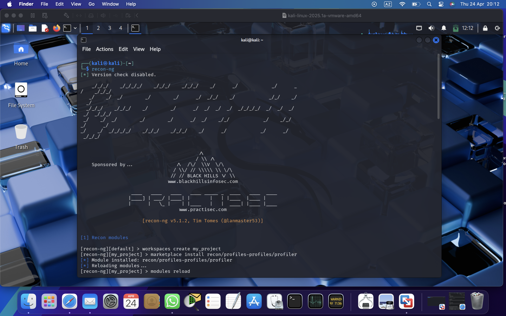
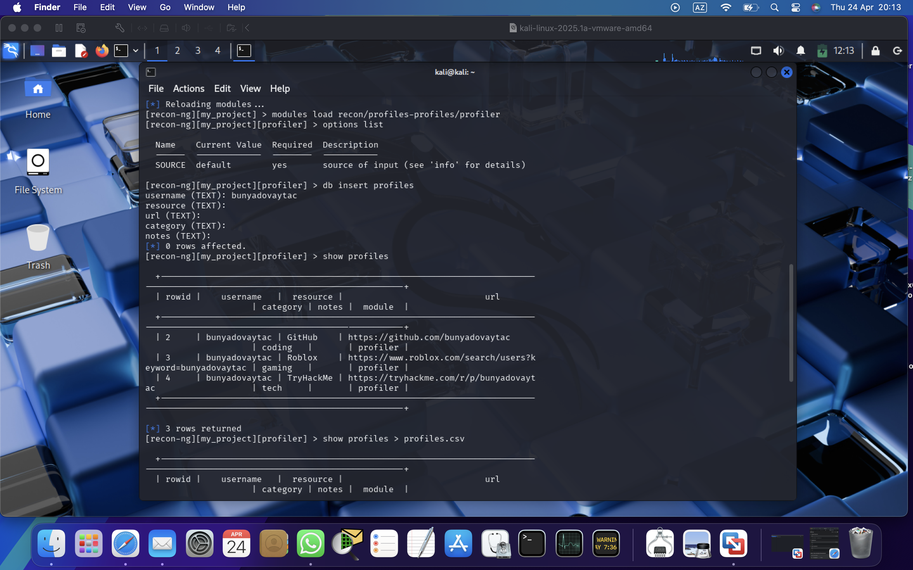
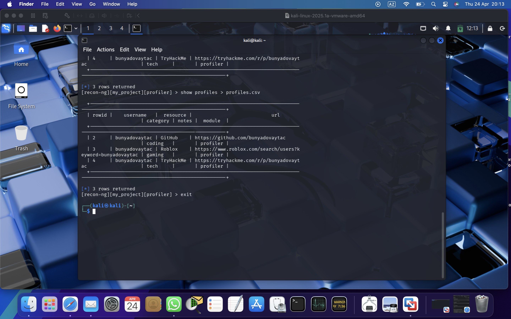

# Cyber-security-Lab-2

In this repository, I have completed a cybersecurity lab assignment using the Recon-ng tool. Below are the screenshots of the steps I followed.

## Step 1: Installing and Loading the Module

## Step 2: Adding the Username

## Step 3: Running the Module and Viewing Results

